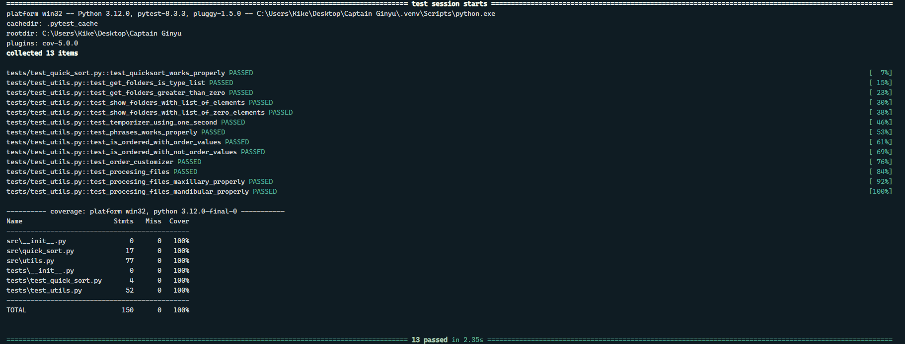
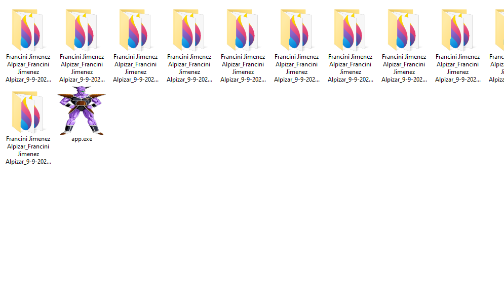

# **Captain Ginyu Script** 


-----------------------------------------------
### Es un script para organizar archivos con un formato stl en un estructura de carpetas establecidas
----------------------------------------------
# Requirments

+ Python 3.12

+ Pip 

+ Pyinstaller

+ Pytest

+ Windows System
---------------------------------------------
# Usage
```bash
#Install all packages

pip install -r requirements.txt

# Generate the file .exe

pyinstaller --onefile --icon=favicon.ico app.py

# Run the tests
pytest --cov -v
```
-------------------------------------------
# Screenshots
+ Running all tests

+ Double click to execute the script

+ Script executing

------------------------------------------
### Created by
## [ userlg ](https://github.com/userlg)
